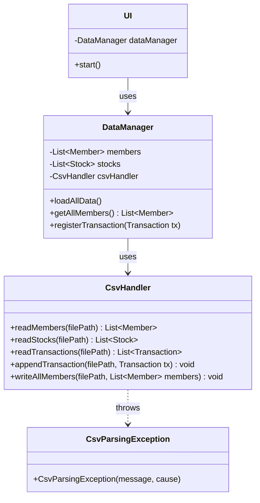

# Refactoring af CsvHandler - Løsningsforslag

Her er mit forslag til refactoring af `CsvHandler` og den omkringliggende datahåndtering. Målet er at skabe en mere robust, vedligeholdelsesvenlig og testbar arkitektur i tråd med OOP-principper.

---

## 1. Analyse af Nuværende Problemer

Den eksisterende `CsvHandler` har fire primære problemer:

1.  **Statisk Tilstand:** Brugen af `static` lister (`userList`, `transactionList`, etc.) fungerer som en global variabel. Det gør koden svær at ræsonnere over, umulig at teste i isolation, og fører til ineffektivitet, da data genindlæses unødigt.
2.  **Blandede Ansvarsområder:** Klassen bryder med Single Responsibility Principle. Den agerer både som fil-læser, data-parser, og data-aggregator (linker transaktioner til brugere).
3.  **Ufuldstændig Funktionalitet:** `writeFile` metoden er ikke implementeret, hvilket er en kritisk mangel for at kunne gemme brugerhandlinger.
4.  **Svag Fejlhåndtering:** Returnering af `RuntimeException` skjuler de specifikke fejl (f.eks. "fil ikke fundet" vs. "dataformat er forkert"), hvilket gør fejlfinding svær.

---

## 2. Forslag til Ny Arkitektur

Jeg foreslår at opdele ansvarsområderne i tre forskellige klasser:

1.  **`DataManager` (Ny):** Bliver hjertet i datahåndteringen.
    *   **Ansvar:** At eje og administrere applikationens "in-memory" data (lister af brugere, aktier etc.). Den fungerer som den centrale "source of truth" under kørsel.
    *   **Levetid:** Instantieres én gang ved programmets opstart.
    *   **Funktion:** Kalder `CsvHandler` for at indlæse al data ved start, linker transaktioner til de respektive brugeres porteføljer, og stiller data til rådighed for resten af applikationen (f.eks. UI-laget). Den orkestrerer også lagring af data.

2.  **`CsvHandler` (Refactored):** Bliver en specialiseret og genbrugelig service-klasse.
    *   **Ansvar:** Udelukkende at håndtere den tekniske læsning og skrivning til CSV-filer. Den har ingen `state` (ingen instance- eller static-felter, der gemmer data).
    *   **Funktion:** Tilbyder metoder som `readMembers`, `readStocks`, `appendTransaction`, `writeAllMembers`. Disse metoder modtager en filsti, udfører deres opgave, og returnerer resultatet eller bekræfter fuldførelse.

3.  **`CsvParsingException` (Ny):** En custom exception for bedre fejlhåndtering.
    *   **Ansvar:** At signalere fejl, der specifikt opstår under parsing af data fra en CSV-fil (f.eks. forkert antal kolonner, ugyldigt talformat).

### Klassediagram over den nye struktur:



---

## 3. Udkast til Implementering

Her er et skelet til, hvordan de nye og ændrede klasser kan se ud.

### `DataManager.java`
```java
package dk.investeringsklubben; // Forslag til nyt package navn

import dk.investeringsklubben.data.CsvHandler;
import dk.investeringsklubben.data.CsvParsingException;
import dk.investeringsklubben.model.*; // Antager at domæneobjekter ligger her

import java.util.List;
import java.util.Map;
import java.util.stream.Collectors;

public class DataManager {
    // Filstier kan centraliseres her
    private static final String MEMBERS_FILE = "Investeringsklubben/src/Files/users.csv";
    private static final String STOCKS_FILE = "Investeringsklubben/src/Files/stockMarket.csv";
    private static final String TRANSACTIONS_FILE = "Investeringsklubben/src/Files/transactions.csv";

    private List<Member> members;
    private List<Stock> stocks;
    private final CsvHandler csvHandler;

    public DataManager() {
        this.csvHandler = new CsvHandler();
    }

    /**
     * Indlæser al data fra CSV-filer og bygger den interne datamodel.
     * Bør kaldes ved applikationens opstart.
     */
    public void loadAllData() {
        try {
            members = csvHandler.readMembers(MEMBERS_FILE);
            stocks = csvHandler.readStocks(STOCKS_FILE);
            List<Transaction> transactions = csvHandler.readTransactions(TRANSACTIONS_FILE);

            // Link transaktioner til de korrekte medlemmer
            linkTransactionsToMembers(transactions);

        } catch (CsvParsingException e) {
            System.err.println("Fejl under indlæsning af data: " + e.getMessage());
            // Her kan vi beslutte, om applikationen skal lukke ned, eller fortsætte med tomme lister.
            // For nuværende, lader vi listerne være tomme eller null, og lader UI'en håndtere det.
        }
    }

    private void linkTransactionsToMembers(List<Transaction> transactions) {
        // Opret et map for hurtigt opslag af medlemmer via deres ID
        Map<Integer, Member> memberMap = members.stream()
                .collect(Collectors.toMap(Member::getUserId, member -> member));

        for (Transaction transaction : transactions) {
            Member member = memberMap.get(transaction.getUserId());
            if (member != null) {
                member.getPortfolio().addTransaction(transaction);
            }
        }
    }

    /**
     * Registrerer en ny transaktion og sikrer, at den bliver gemt.
     * @param transaction Den nye transaktion, der skal tilføjes.
     */
    public void registerTransaction(Transaction transaction) {
        // 1. Føj til den relevante medlems portefølje i hukommelsen
        // (Logik til at finde medlemmet og opdatere portefølje)

        // 2. Opdater medlemmets kontantbeholdning
        // (Logik til at udregne og sætte ny 'cash' værdi)

        // 3. Gem den nye transaktion til filen
        csvHandler.appendTransaction(TRANSACTIONS_FILE, transaction);

        // 4. Gem den opdaterede medlemsliste til filen for at sikre data-integritet
        csvHandler.writeAllMembers(MEMBERS_FILE, this.members);
    }

    // Getters til at give UI-laget adgang til data
    public List<Member> getMembers() {
        return this.members;
    }

    public List<Stock> getStocks() {
        return this.stocks;
    }
}
```

### `CsvHandler.java` (Refactored)
```java
package dk.investeringsklubben.data;

import dk.investeringsklubben.model.*;
import java.io.*;
import java.nio.file.Files;
import java.nio.file.Paths;
import java.nio.file.StandardOpenOption;
import java.time.LocalDate;
import java.time.format.DateTimeFormatter;
import java.util.ArrayList;
import java.util.List;

public class CsvHandler {

    private static final DateTimeFormatter FORMATTER = DateTimeFormatter.ofPattern("dd-MM-yyyy");
    private static final String SEPARATOR = ";";

    public List<Member> readMembers(String filePath) throws CsvParsingException {
        List<Member> members = new ArrayList<>();
        try (BufferedReader br = new BufferedReader(new FileReader(filePath))) {
            br.readLine(); // Spring header over
            String line;
            while ((line = br.readLine()) != null) {
                String[] parts = line.split(SEPARATOR);
                // Validering af 'parts' længde
                // ...
                // Opret Member objekt og tilføj til listen
            }
        } catch (IOException | NumberFormatException e) {
            throw new CsvParsingException("Kunne ikke læse eller parse medlemsfil: " + filePath, e);
        }
        return members;
    }

    // Lignende metoder for readStocks og readTransactions...

    /**
     * Tilføjer en enkelt transaktion til slutningen af en CSV-fil.
     * @param filePath Stien til filen.
     * @param transaction Transaktionen der skal gemmes.
     */
    public void appendTransaction(String filePath, Transaction transaction) {
        String csvLine = convertTransactionToCsvLine(transaction);
        try {
            Files.write(Paths.get(filePath), (csvLine + System.lineSeparator()).getBytes(), StandardOpenOption.APPEND, StandardOpenOption.CREATE);
        } catch (IOException e) {
            // I en rigtig applikation ville vi logge denne fejl. For nu printer vi til konsollen.
            System.err.println("Fejl: Kunne ikke gemme transaktion til fil: " + e.getMessage());
        }
    }

    /**
     * Overskriver hele bruger-filen med en ny liste af medlemmer.
     * @param filePath Stien til filen.
     * @param members Listen af medlemmer der skal gemmes.
     */
    public void writeAllMembers(String filePath, List<Member> members) {
        List<String> lines = new ArrayList<>();
        lines.add("userId;full_name;email;birth_date;initial_cash_DKK;created_at;last_updated"); // Header
        for (Member member : members) {
            lines.add(convertMemberToCsvLine(member));
        }

        try {
            Files.write(Paths.get(filePath), lines, StandardOpenOption.CREATE, StandardOpenOption.TRUNCATE_EXISTING);
        } catch (IOException e) {
            System.err.println("Fejl: Kunne ikke overskrive medlemsfil: " + e.getMessage());
        }
    }
    
    // Private hjælpemetoder til at konvertere objekter til CSV-strenge
    private String convertTransactionToCsvLine(Transaction t) { /* ... implementering ... */ return ""; }
    private String convertMemberToCsvLine(Member m) { /* ... implementering ... */ return ""; }
}
```

### `CsvParsingException.java`
```java
package dk.investeringsklubben.data;

public class CsvParsingException extends Exception {
    public CsvParsingException(String message, Throwable cause) {
        super(message, cause);
    }
}
```

---

## 4. Test-strategi med JUnit

Med den nye struktur bliver det markant lettere at skrive meningsfulde unit tests.

### Test af `CsvHandler`
*   **Fokus:** At teste læse- og skrive-logikken i isolation.
*   **Metode:**
    1.  Opret midlertidige test-filer (`@TempDir` i JUnit 5) med kendt indhold.
    2.  **Test `readMembers`:** Kald metoden med stien til test-filen og verificer, at den returnerede `List<Member>` indeholder de forventede objekter.
    3.  **Test `appendTransaction`:** Kald metoden og læs derefter filens indhold for at verificere, at den nye linje er tilføjet korrekt.
    4.  **Test `writeAllMembers`:** Kald metoden og verificer, at filens indhold er blevet fuldstændig overskrevet med det forventede data.
    5.  **Test Fejlhåndtering:** Opret en korrupt fil (f.eks. med bogstaver i et talfelt) og verificer, at metoden kaster en `CsvParsingException`.

### Test af `DataManager`
*   **Fokus:** At teste data-logikken (f.eks. linkning af data) uafhængigt af filsystemet.
*   **Metode:** Brug en **mocking-framework** som [Mockito](https://site.mockito.org/).
    1.  **Mock `CsvHandler`:** I din test af `DataManager`, opret en mock-version af `CsvHandler`.
    2.  **Definer Mock-adfærd:** Brug Mockito til at instruere mock-`CsvHandler`'en i at returnere præ-definerede lister af `Member`, `Stock`, og `Transaction` objekter, når dens læse-metoder kaldes.
    3.  **Test `loadAllData`:** Kald `dataManager.loadAllData()` og verificer derefter, at `dataManager`'ens interne `members`-liste korrekt har fået tilknyttet transaktionerne. Tjek f.eks. at `member.getPortfolio().getTransactions()` ikke er tom.
    4.  **Test `registerTransaction`:** Kald `dataManager.registerTransaction()` og brug `Mockito.verify()` til at tjekke, at `csvHandler.appendTransaction()` og `csvHandler.writeAllMembers()` blev kaldt præcis én gang med de korrekte argumenter.

---

## 5. Fordele ved Refactoring

1.  **Klar Ansvarsfordeling (SRP):** Hver klasse har ét klart formål, hvilket gør koden lettere at forstå, debugge og vedligeholde.
2.  **Forbedret Testbarhed:** Logik (`DataManager`) kan testes uafhængigt af I/O (`CsvHandler`), hvilket fører til hurtigere og mere pålidelige tests.
3.  **Øget Robusthed:** Centraliseret datahåndtering og specifikke exceptions gør systemet mere forudsigeligt og lettere at fejlfinde i.
4.  **Fleksibilitet:** Hvis I en dag vil skifte fra CSV til en database, skal kun `CsvHandler` udskiftes. `DataManager` og resten af applikationen forbliver uændret.